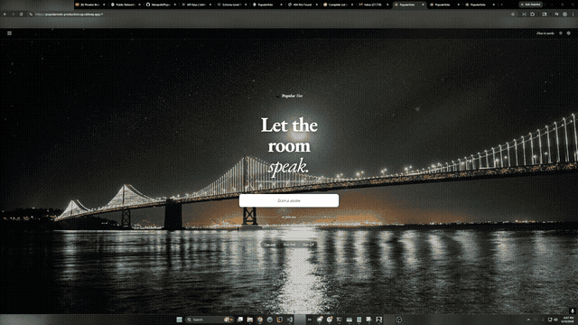
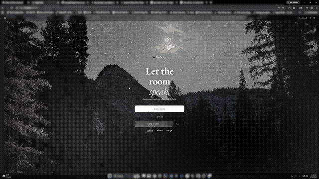
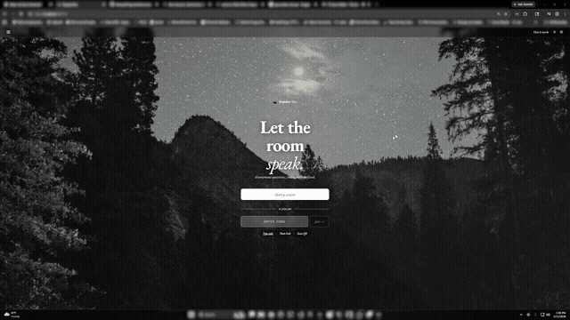
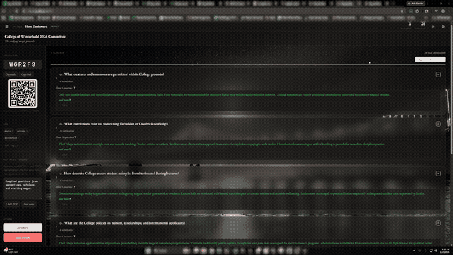
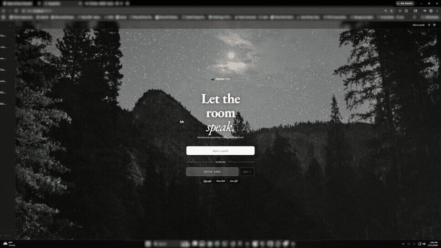
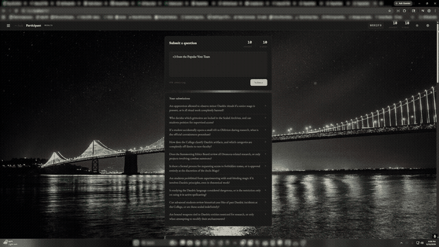
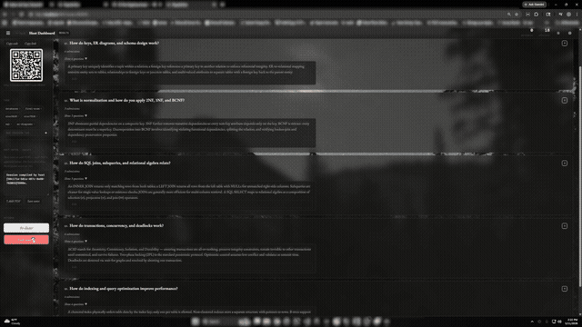

<div align="center">
  <br/>
  <p>
    
  </p>

  <h1>𝑃𝑜𝑝𝑢𝑙𝑎𝑟𝑉𝑜𝑡𝑒</h1>
  <p>Anonymous questions, collectively surfaced.</p>

  <p><a href="https://popularvote.marqed.it">🌐 Popular Vote Website</a></p>
  <p><a href="https://github.com/Marqed4/PopularVote">📦 View the repository</a></p>
  <br/>
</div>
<div align="center">
  Open a session, let the room ask anything, cluster the noise into signal, and respond to what actually matters.
</div>

---

<h2 align="center">Homepage</h2>

<div align="center">
  
  <p><sub>Day & night mode · Background selector</sub></p>
</div>

---

<h2 align="center">See it in action</h2>

<h3 align="center">Start a session or jump into one</h3>
<div align="center">
  <p><sub>Create a session in seconds, or join with a code, a link, or a QR scan.</sub></p>
  
</div>

<h3 align="center">Watch the room fill up ,  in real time</h3>
<div align="center">
  <p><sub>Share the code, watch submissions roll in, cluster when you're ready.</sub></p>
  
</div>

<h3 align="center">The host's full view</h3>
<div align="center">
  <p><sub>Clusters, responses, participant management ,  everything in one place.</sub></p>
  
</div>

<h3 align="center">What participants see</h3>
<div align="center">
  <p><sub>Submit anonymously, watch your question surface, upvote what matters.</sub></p>
  
</div>

<h3 align="center">The participant's full view</h3>
<div align="center">
  <p><sub>See clusters form, read responses, and dig deeper in round two.</sub></p>
  
</div>

<h3 align="center">Close out & take the results with you</h3>
<div align="center">
  <p><sub>End the session and download a clean PDF summary of every cluster and response.</sub></p>
  
</div>

---

<h2 align="center">Features</h2>

<div align="left">

- **Anonymous submissions**
  Participants submit questions freely without any pressure. No names, no judgment.

- **AI-powered clustering**
  Submissions are automatically grouped by meaning so hosts see themes, not clutter.

- **Host responses**
  Hosts write a single response per cluster, answering everyone who asked the same thing at once.

- **Live session management**
  Share a session code, link, or QR code. Track participants and submissions in real time.

- **Participant upvoting**
  Once results are live, participants can upvote questions inside a cluster to surface what matters most.

- **Session summary & PDF export**
  At the end of a session, a full summary of clusters and host responses can be downloaded as a PDF.

- **Optional accounts**
  Sign in to have your submissions remembered across devices. The app is fully usable without an account.

- **Day & night mode**
  Switch between light and dark themes with a customizable background selector.

</div>

---

<h2 align="center">Getting Started</h2>

<div align="left">

**1. Clone the repo**
```bash
git clone https://github.com/Marqed4/PopularVote.git
cd PopularVote
```

**2. Install dependencies**
```bash
npm install
```

**3. Set up environment variables**

Create `server/database/.env`:
```
SUPABASE_URL=your_supabase_url
SUPABASE_KEY=your_supabase_anon_key
GEMINI_API_KEY=your_gemini_api_key
```

Create `.env` in the project root:
```
VITE_SUPABASE_URL=your_supabase_url
VITE_SUPABASE_ANON_KEY=your_supabase_anon_key
VITE_API_URL=your_server_url
```

**4. Run the project**
```bash
npm run dev
```

This starts both the Vite frontend and the Node server concurrently. Open [http://localhost:6967](http://localhost:6967) in your browser.

</div>

---

<h2 align="center">Tech Stack</h2>

<div align="left">

- **Frontend** : React + Vite
- **Backend** : Node.js (Express) + Socket.io
- **Database** : PostgreSQL (via Supabase)
- **Authentication** : Google Identity Services (Google Auth API 2.0)
- **AI** : Google Gemini
- **Styling** : CSS

</div>

---

<h2 align="center">Hosting Note</h2>

<div align="center">
Both the frontend and backend are hosted on Render's free tier. Free tier services spin down after periods of inactivity, so the first request after idle time (or a cold start) can take 50+ seconds to respond while the service spins back up. Subsequent requests will be fast. Please be patient on that first load.
</div>

---

<h2 align="center">Contributing</h2>

If you're thinking about contributing to PopularVote, first of all, thank you!
Feel free to open an issue or submit a pull request; all feedback is welcomed.

For full contribution guidelines, please see the 
<a href="documents/legal/CONTRIBUTING.md">Contributing Guide</a>.

---

<h2 align="center">License</h2>

This repository is licensed under [GNU General Public License (GPLv3)](documents/licenses/GNU%20GENERAL%20PUBLIC%20LICENSE%20Version%203,%2029%20June%202007.txt)

---

<h2 align="center">Legal</h2>

For all licensing, service notices, privacy details, and security policies, see the
<a href="LEGAL.md">Legal Overview</a>.
