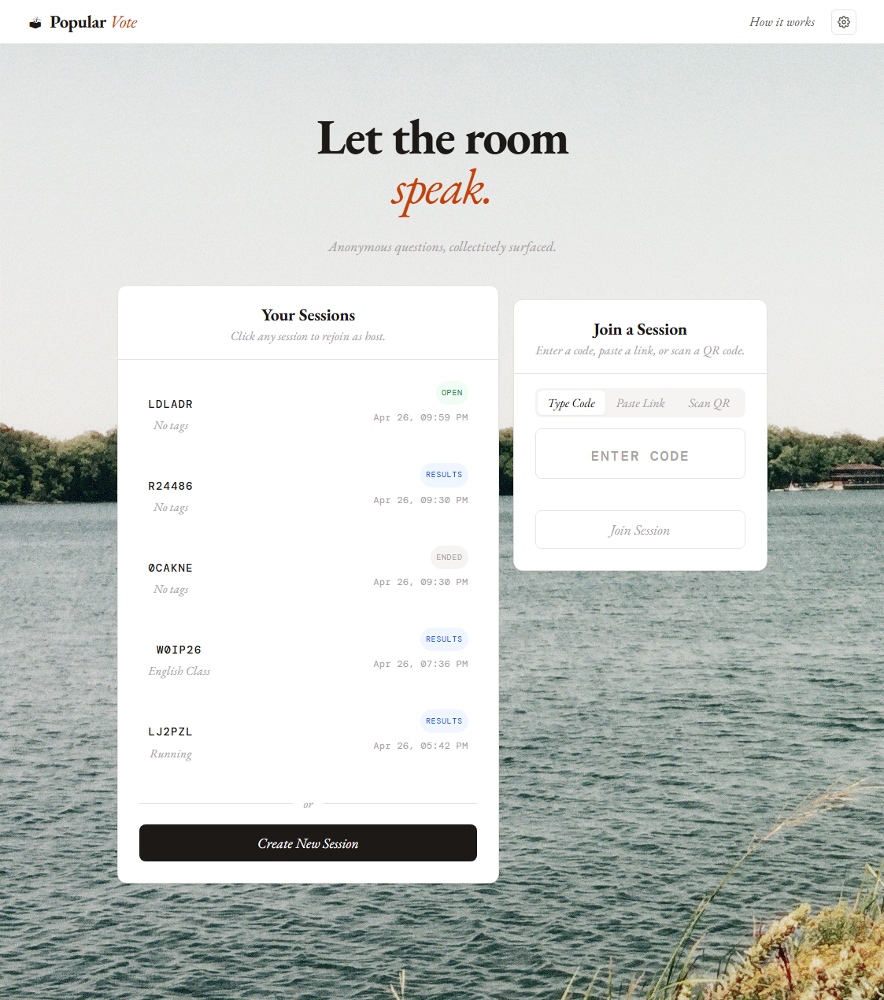
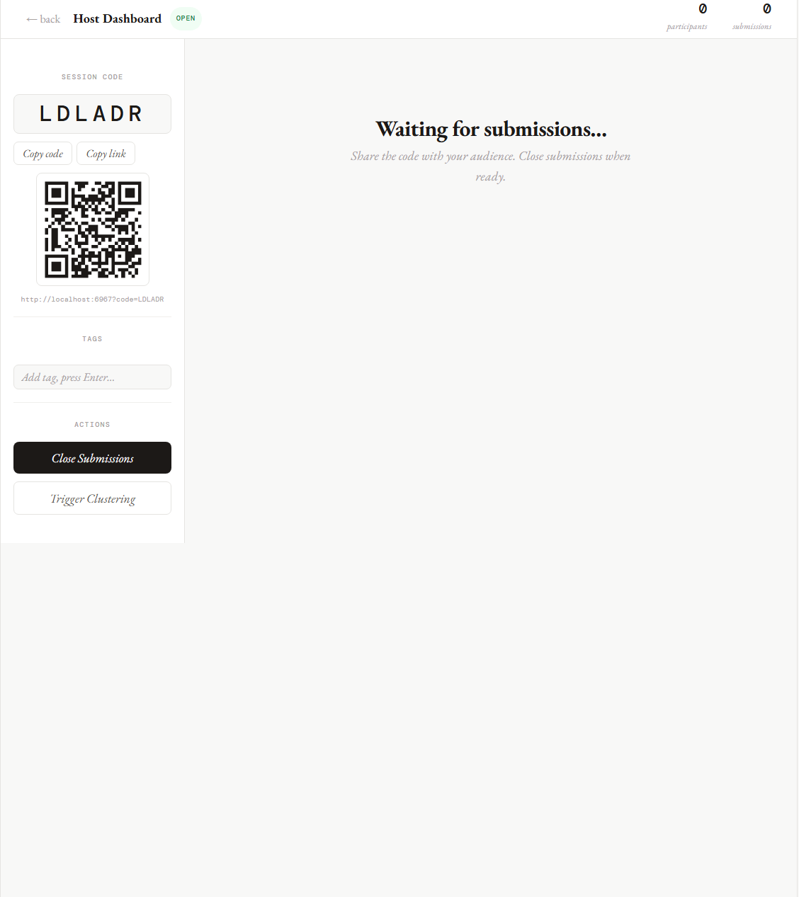
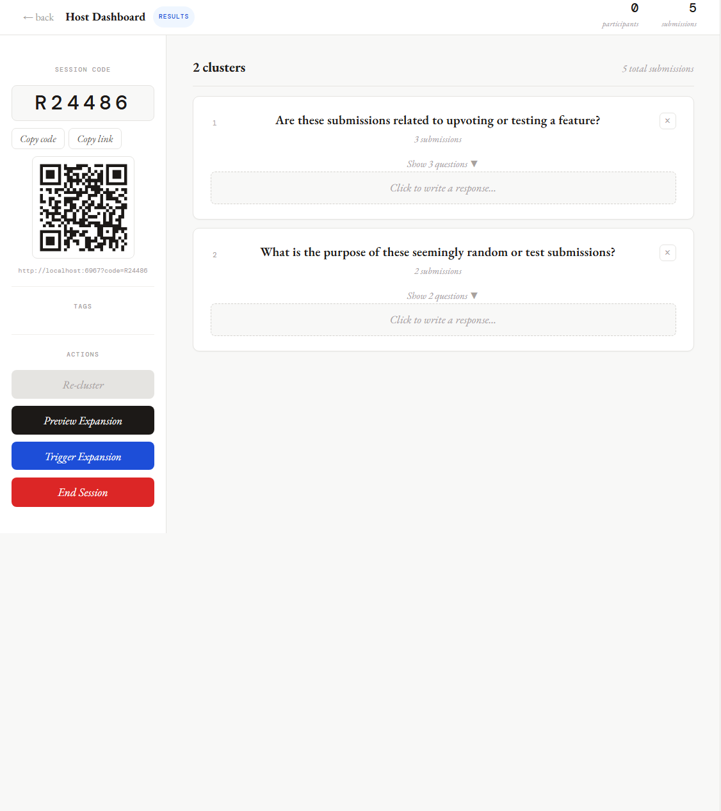
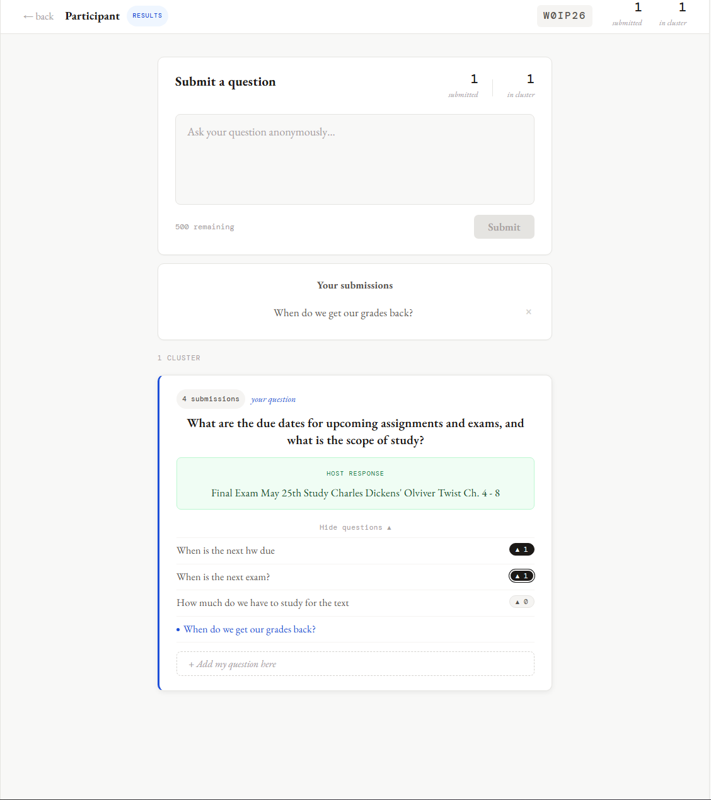

<div align="center">
  <br/>
  <p>
    
  </p>

  <h1>𝑃𝑜𝑝𝑢𝑙𝑎𝑟𝑉𝑜𝑡𝑒</h1>
  <p>Anonymous questions, collectively surfaced.</p>

  <p>
    <a href="https://github.com/Marqed4/PopularVote">🗳️ View the repository</a>
  </p>
  <br/>
</div>
<div align="center">
  Open a session, let the room ask anything, cluster the noise into signal, and respond to what actually matters.
</div>

---

<h2 align="center">Views</h2>

| | |
|---|---|
| <p align="center"><strong>Landing page</strong><br/>Create a new session or join one with a code, a link, or a QR scan.</p> | <p align="center"><strong>Open session - host view</strong><br/>Share the code. Watch submissions come in. Close when the room is ready.</p> |
| <p align="center"></p> | <p align="center"></p> |
| <p align="center"><strong>Results - host view</strong><br/>AI clusters similar questions together. Write a response to the ones that matter.</p> | <p align="center"><strong>Results - participant view</strong><br/>See your question land in a cluster, upvote others, and read the host's response.</p> |
| <p align="center"></p> | <p align="center"></p> |

---

<h2 align="center">Features</h2>

<div align="left">

- **Anonymous submissions**  
  Participants submit questions freely without any pressure. No names, no judgment.

- **AI-powered clustering**  
  Submissions are automatically grouped by meaning so hosts see themes, not clutter.

- **Host responses**  
  Hosts write a single response per cluster, answering everyone who asked the same thing at once.

- **Live session management**  
  Share a session code, link, or QR code. Track participants and submissions in real time.

- **Participant upvoting**  
  Once results are live, participants can upvote questions inside a cluster to surface what matters most.

</div>

---

<h2 align="center">Getting Started</h2>

<div align="left">

**1. Clone the repo**
```bash
git clone https://github.com/Marqed4/PopularVote.git
cd PopularVote
```

**2. Install dependencies**
```bash
npm install
```

**3. Set up environment variables**

Create a file at `server/database/.env` with the following:
```
SUPABASE_URL=your_supabase_url
SUPABASE_KEY=your_supabase_anon_key
GEMINI_API_KEY=your_gemini_api_key
```

**4. Run the project**
```bash
npm run dev
```

This starts both the Vite frontend and the Node server concurrently. Open [http://localhost:6967](http://localhost:6967) in your browser.

</div>

---

<h2 align="center">Tech Stack</h2>

<div align="left">

- **Frontend** - React + Vite
- **Backend** - Node.js (Express)
- **Styling** - CSS

</div>

---

<h2 align="center">Contributing</h2>

- If you're thinking about contributing to PopularVote, first of all, thank you!
- Feel free to open an issue or submit a pull request. All feedback is welcomed.

---

<h2 align="center">License</h2>

This repository is licensed under [MIT](LICENSE)
